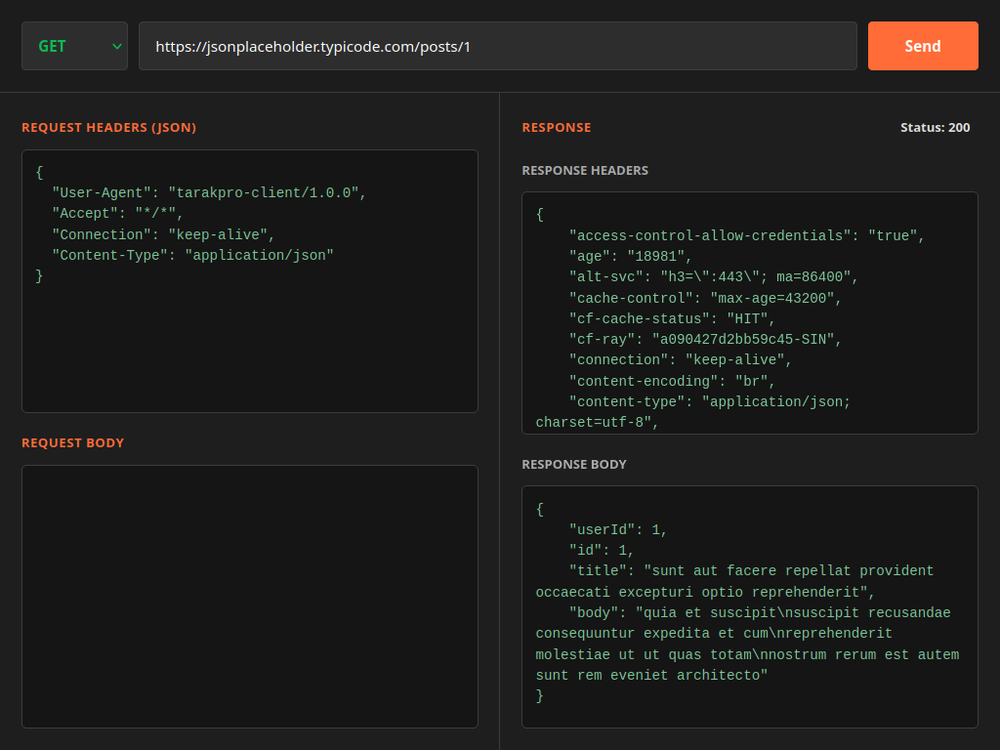

# HTTP Client

## 🎮 Preview


## 🛠️ Tech Stack


## .env Setup
- Create a .env file to your project folder
```env
PORT=5678
```

## CMD

### Install Required Libraries
```bash
pnpm install
```

### Run the Server
```bash
pnpm start
```

### Run Server with Hot Reload
```bash
pnpm dev
```

